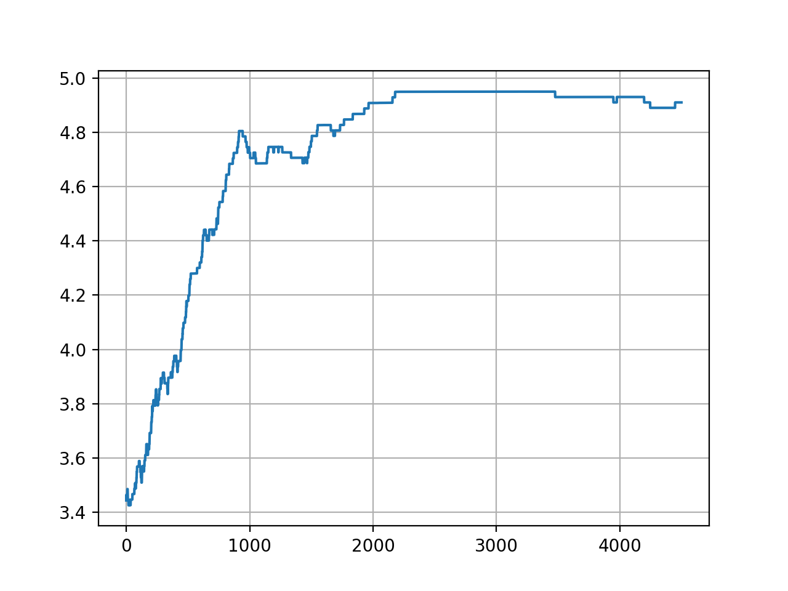
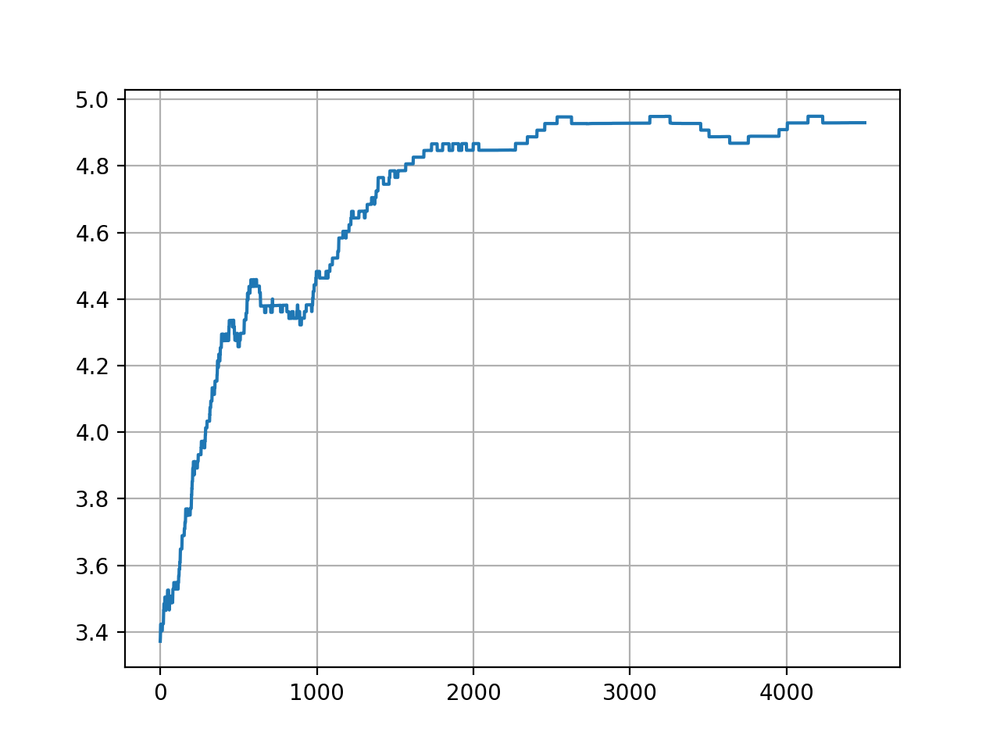
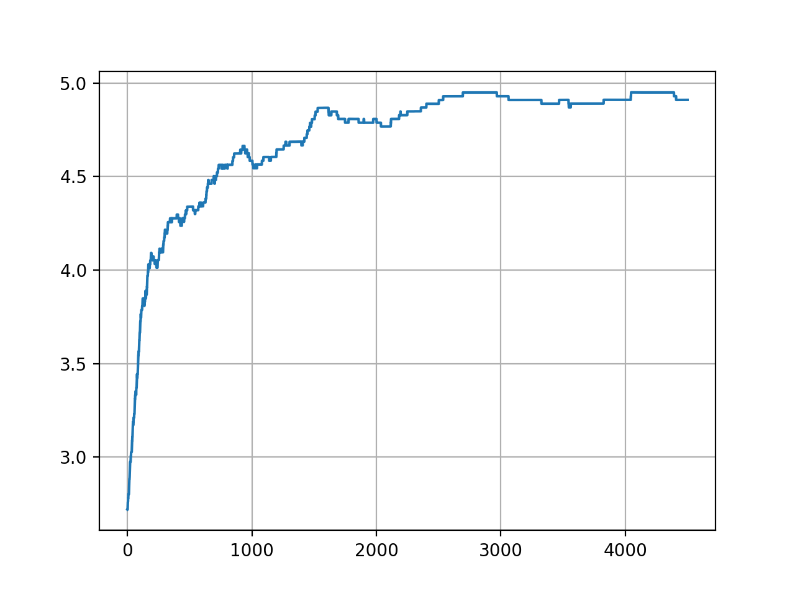

# Maze :: methods performance comparison

## Environment
```
...f
.o.x
s...
```
- Deterministic, step cost: 0.01
- `f` - finish, reward +5
- `x` - death, reward -5

## Q-table

- Episodes: 3000
- Policy
```
→→→f
↑o↑x
→→↑←
```
- Rewards


## NN

Note: no experience replay, no target network.

Architecture: [0, 0, ..., 1, ..., 0] -> [a1, a2, a3, a4] (one-hot encoded states connected to actions)

- Episodes: 5000
- Policy
```
→→→f
→o↑x
→→↑←
```
- Rewards


## NN, experience replay

Note: no target network.

- Episodes: 5000
- Policy
```
→→→f
↑o↑x
↑→↑←
```
- Rewards


## NN, experience replay, target network

- Episodes: 5000
- Policy
```
→→→f
↑o↑x
↑→↑←
```
- Rewards
