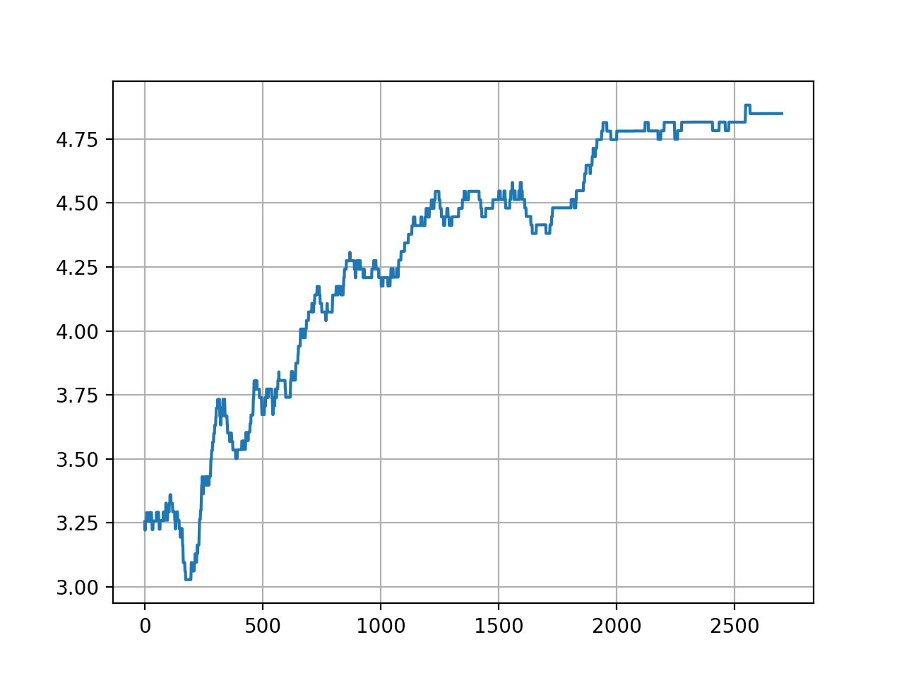

# Maze :: methods performance comparison

## Environment
```
...f
.o.x
s...
```
- Deterministic, step cost: 0.01
- `f` - finish, reward +5
- `x` - death, reward -5

## Q-table

- Episodes: 3000
- Policy
```
→→→f
↑o↑x
→→↑←
```
- Rewards
